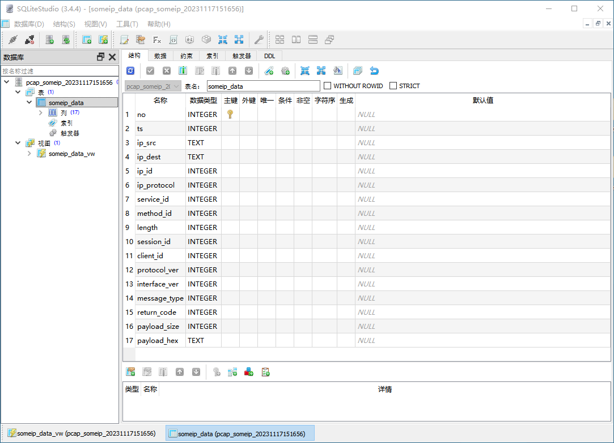
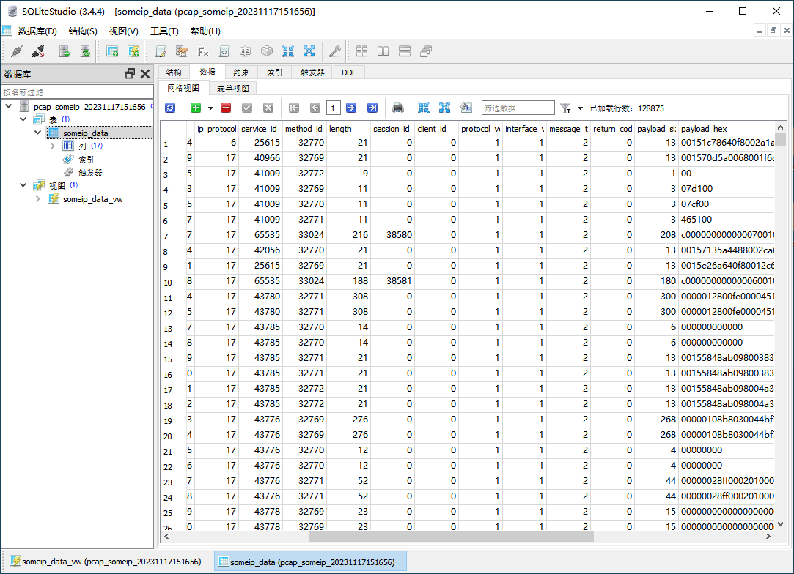
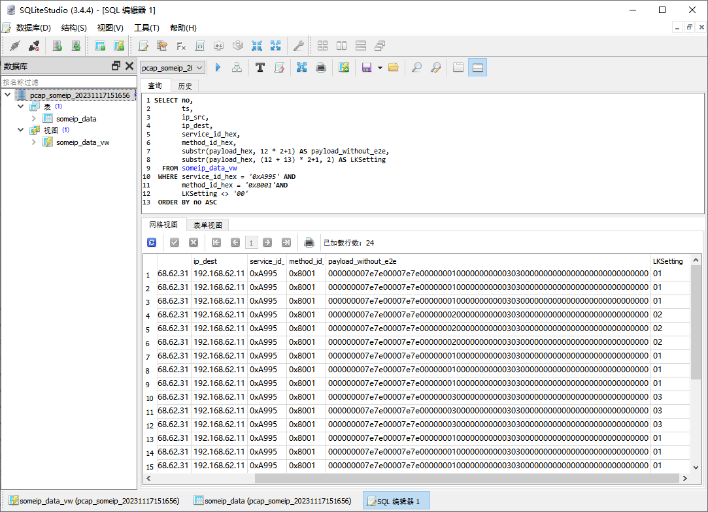

# pcap-someip

Extract SOME/IP packet from pcap file and convert/store the data into database(sqlite). The purpose of this tool is utilize the SQL to filter/analysis SOME/IP payload.

## Pre-condition

### PcapPlusPlus

[PcapPlusPlus](https://github.com/seladb/PcapPlusPlus/) is a multiplatform C++ library for capturing, parsing and crafting of network packets. It is designed to be efficient, powerful and easy to use. It provides C++ wrappers for the most popular packet processing engines such as libpcap, Npcap, WinPcap, DPDK and PF_RING. 

#### Build from source

```bash
sudo apt-get install libpcap-dev
git clone https://github.com/seladb/PcapPlusPlus.git
cd PcapPlusPlus
cmake -S . -B build
cmake --build build
cd build
make
sudo cmake --install .
```
* PcapPlusPlus libs:
  * build/Common++/libCommon++.a
  * build/Packet++/libPacket++.a
  * build/Pcap++/libPcap++.a

### SQLiteCpp

[SQLiteC++](https://github.com/SRombauts/SQLiteCpp) (SQLiteCpp) is a smart and easy to use C++ SQLite3 wrapper. 

#### Build from source

```bash
git clone https://github.com/SRombauts/SQLiteCpp.git
cd SQLiteCpp
git submodule init
git submodule update

mkdir build
cd build
cmake ..
cmake --build .
sudo cmake --install .
```

* SQLiteCpp libs:
  * build/libSQLiteCpp.a
  * build/sqlite3/libsqlite3.a


## Usage

```
--pcap <pcap file path> --ports <someip ports> [--db <extract data to stored database path>] [--keep] [--no <begin index>]
```

1. pcap file path ;example: `--pcap /path/capture.pcap`
2. someip used ports, split by comma; example: `--ports 30501,30500`
3. optional; database store path, default pcap_someip.db3 ;example: `--db /path/someip_db.db3`
4. optional; keep orginal record in database if already exits table.
5. optional; the recored no column begin index, default 0.

Example:
```bash
./pcap-someip2db --pcap /home/sample.pcap --ports 30490,30500,30501

./pcap-someip2db --pcap /home/sample.pcap --ports 30490,30500,30501 --db /home/output.db3

./pcap-someip2db --pcap /home/sample.pcap --ports 30490,30500,30501 --db /home/output.db3 --keep --no 12000
 ```

## SQLiteStudio

A free, open source, multi-platform SQLite database manager. 
https://github.com/pawelsalawa/sqlitestudio






